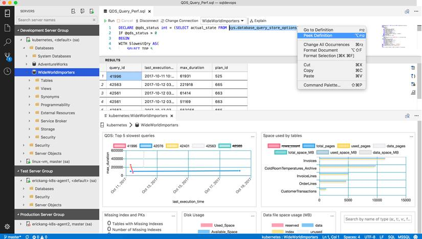

<a id="top" />

 

[**Back to main**](./README.md)

---

<a id="tools" />

## Tools

 

**Microsoft SQL Server**

Microsoft SQL Server is a relational database management system (RDBMS).

|  Version | Description | Donwload | 
| --- | --- | --- |   
|  Express | Free edition of SQL Server, ideal for development and production for desktop, web, and small server applications. | - [2022](https://go.microsoft.com/fwlink/p/?linkid=2216019)   - [2019](https://www.microsoft.com/Download/details.aspx?id=101064) |
| Developer | Full-featured free edition, licensed for use as a development and test database in a non-production environment. | [2022](https://go.microsoft.com/fwlink/p/?linkid=2215158&clcid=0x409&culture=en-us&country=us) | 

> Run the downloaded installer and select the Basic installation option.

---

 

**Microsoft Azure Data Studio**

Azure Data Studio is a lightweight, cross-platform data management and development tool with connectivity to popular cloud and on-premises databases.

| Platform | Type | Download |
| --- | --- | --- |
| Windows | User Installer | [x64](https://go.microsoft.com/fwlink/?linkid=2251836)&emsp;[ARM64](https://go.microsoft.com/fwlink/?linkid=2251642) |
| | System Installer | [x64](https://go.microsoft.com/fwlink/?linkid=2251733)&emsp;[ARM64](https://go.microsoft.com/fwlink/?linkid=2251734) |
| | .zip | [x64](https://go.microsoft.com/fwlink/?linkid=2251837)&emsp;[ARM64](https://go.microsoft.com/fwlink/?linkid=2251735) |
| macOS | .zip | [Universal](https://go.microsoft.com/fwlink/?linkid=2251737)&emsp;[Intel Chip](https://go.microsoft.com/fwlink/?linkid=2251738)&emsp;[Apple Silicon](https://go.microsoft.com/fwlink/?linkid=2251739) |
| Linux | .tar.gz | [x64](https://go.microsoft.com/fwlink/?linkid=2251643) |
| | .deb | [x64](https://go.microsoft.com/fwlink/?linkid=2251736) |
| | .rpm1 | [x64](https://go.microsoft.com/fwlink/?linkid=2251838) |

> Note: 1 There's a known issue with install on RHEL. For more information, see the [release notes](https://learn.microsoft.com/en-us/azure-data-studio/release-notes-azure-data-studio#known-issues-in-1470).

**Microsoft Azure Data Studio Extensions**

Download Steps

1. Download the appropriate VSIX package from the tables above.
1. Open **Azure Data Studio**, click **File**, then click **Install Extension from VSIX Package**. Select the downloaded VSIX package for the extension you would like.

| Name | Download Link | Repository Link | Description |
| --- | ---- | --- | --- |
| Admin Pack for SQL Server | [VSIX](https://go.microsoft.com/fwlink/?linkid=2099889) | [Microsoft/azuredatastudio](https://github.com/Microsoft/azuredatastudio) |  A collection of popular database administration extensions to help manage SQL Server |
| Database Administration Tool Extensions for Windows | [VSIX](https://go.microsoft.com/fwlink/?linkid=2099888) | [Microsoft/azuredatastudio](https://github.com/Microsoft/azuredatastudio) | Adds Windows-specific functionality to Azure Data Studio, including launching a set of SQL Server Management Studio (SSMS) experiences directly from Azure Data Studio |
| SQL Server Agent 	| [VSIX](https://go.microsoft.com/fwlink/?linkid=2099884) | [Microsoft/azuredatastudio](https://github.com/Microsoft/azuredatastudio) | Helps manage and troubleshoot SQL Server Agent jobs and configuration (early preview) |
| Central Management Servers | [VSIX](https://go.microsoft.com/fwlink/?linkid=2099771) | [Microsoft/azuredatastudio](https://github.com/Microsoft/azuredatastudio) | Allows users to organize and store lists of instances as one or more groups, where actions taken using a CMS group act on all servers in the server group (early preview) |
| IntelliCode | [VSIX](https://go.microsoft.com/fwlink/?linkid=2180462) | [Microsoft/azuredatastudio](https://github.com/Microsoft/azuredatastudio) | IntelliCode enhances software development using artificial intelligence. IntelliCode delivers context-aware code completions and guides developers to adhere to the patterns and styles of their team. |
| SQL Server Profiler | [VSIX](https://go.microsoft.com/fwlink/?linkid=2099574) | [Microsoft/azuredatastudio](https://github.com/Microsoft/azuredatastudio) | Provides a simple SQL Server tracing solution similar to SSMS Profiler, allowing users to create and manage traces and analyze and replay trace results |
| Query History | [VSIX](https://go.microsoft.com/fwlink/?linkid=2109534) | [Microsoft/azuredatastudio](https://github.com/Microsoft/azuredatastudio) | Adds a Query History panel for viewing and running past executed queries. |
| SQL Server Assessment | [VSIX](https://go.microsoft.com/fwlink/?linkid=2133900) | [Microsoft/azuredatastudio](https://github.com/Microsoft/azuredatastudio) | Provides a mechanism to evaluate the configuration of SQL Server for best practices. |

---

 

**SQL Server Management Studio (SSMS)**

SQL Server Management Studio (SSMS) is an integrated environment for managing any SQL infrastructure, from SQL Server to Azure SQL Database. 

- [ Free Download for SQL Server Management Studio (SSMS)](https://aka.ms/ssmsfullsetup)

> Note: Beginning with SQL Server Management Studio (SSMS) 18.7, Azure Data Studio is automatically installed alongside SSMS. 

---

 

[**Return to top**](#top) | [**Back to main**](./README.md)

 

---